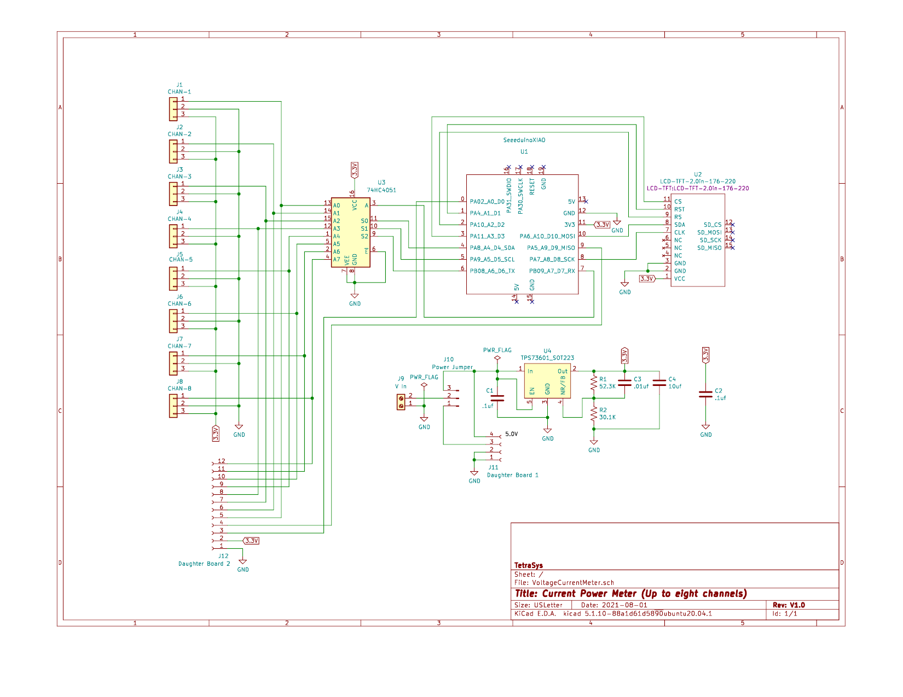

*********************
Voltage Current Meter
*********************
The MIT License (MIT)

A circuit to show voltage and current on a TFT display. Parts can be added
using a small array of mounting holes on the board, plus two daughter boards
can be plugged into female connectors. There is an on board 5V to 3.3V
regulator which powers all components.

=====
KiCAD
=====

KiCAD files of the schematic and PCB.

==================
Setup Instructions
==================

  1. J1 - J8 are JST 1.5mm 3-pin connectors and are for the analog inputs or
     outputs of the 74HC4051 (8-Channel Analog Multiplexer/Demultiplexer).
  2. J9 is a screw terminal block for the circuits supply voltage.
  3. J10 is the Power Jumper. It allows the use of 5V on J9 or routes the
     V-IN on J9 to  a daughter board which can convert the voltage on J9 to 5V.
  4. J11 is a 4 pin standard female socket for the optional Daughter Board 1.
     This board can be used for external circuitry to convert any voltage to
     the 5 volts needed by the 3.3V regulator.
  5. J12 is a 12 pin standard female socket that provides the 2nd daughter
     board with all the control pins from the 74HC4051. It also provides the
     two pins not used on the Seeeduino XIAO plus ground and 3.3V power.

==============
PCBs Version 1
==============

=========
Schematic
=========

================
Arduino Sketches
================

Below are the sketches that use this board.

--------------
BatteryCharger
--------------

This sketch displays the Voltage and Current limited values and the actual
values while charging Li-Ion batteries. The charging voltage is adjustable to
3 (12.6V), 4 (16.8V), or 5 (21.0V) depending on the number of cells. The
default current is limited to 1250mA or can be set to adjustable using a
potentiometer.

Feel free to contact me at: carl dot nobile at gmail.com
